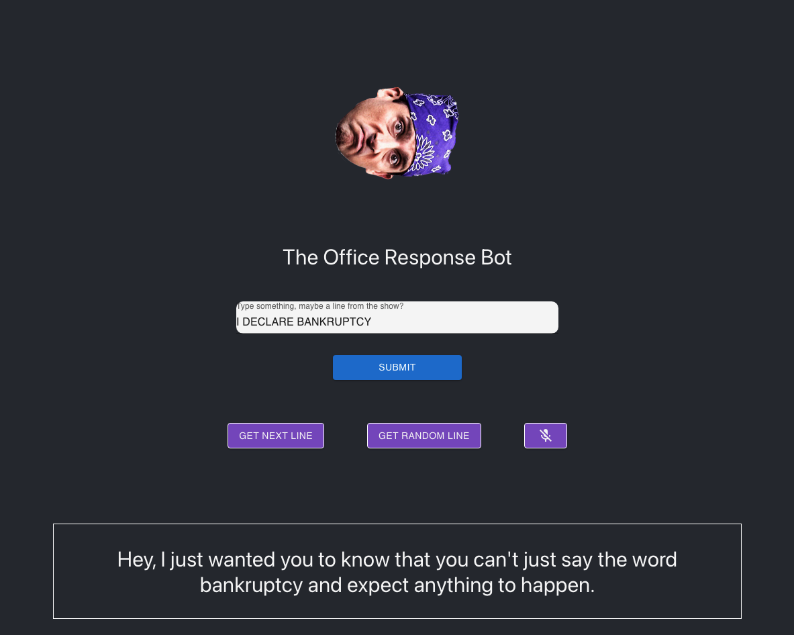

# The Office Chat Bot

## Description
The Office Chat Bot is a fun project that uses lines from the famous NBC's sitcom "The Office". It provides responses based on the user's input. If the user's input matches a line from the show, the bot responds with the following line from the script.

This method sends a request to the API endpoint provided by "The Office Script" and fetches the relevant response based on the user's input.

## Screenshots
Here is a preview of the chat bot in action:

## Example

Consider this [scene](https://www.youtube.com/watch?v=T_d3teq6pWw) from "The Office"

If you type, "I declare bankruptcy."

The bot will respond with "Hey, I just wanted you to know that you can't just say the word bankruptcy and expect anything to happen"

## Links
- [Project Code on GitHub](https://github.com/zubyj/the-office-chat-bot)
- [The Office Script API](https://theofficescript.com)
- [Reddit Bots using the same API](https://www.reddit.com/user/the-office-bot/)

This project was bootstrapped with [Create React App](https://github.com/facebook/create-react-app).

